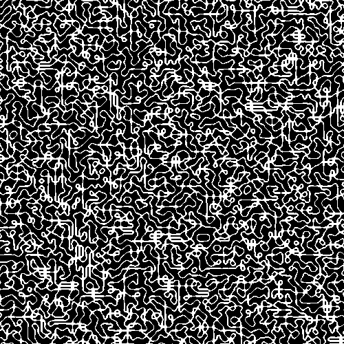
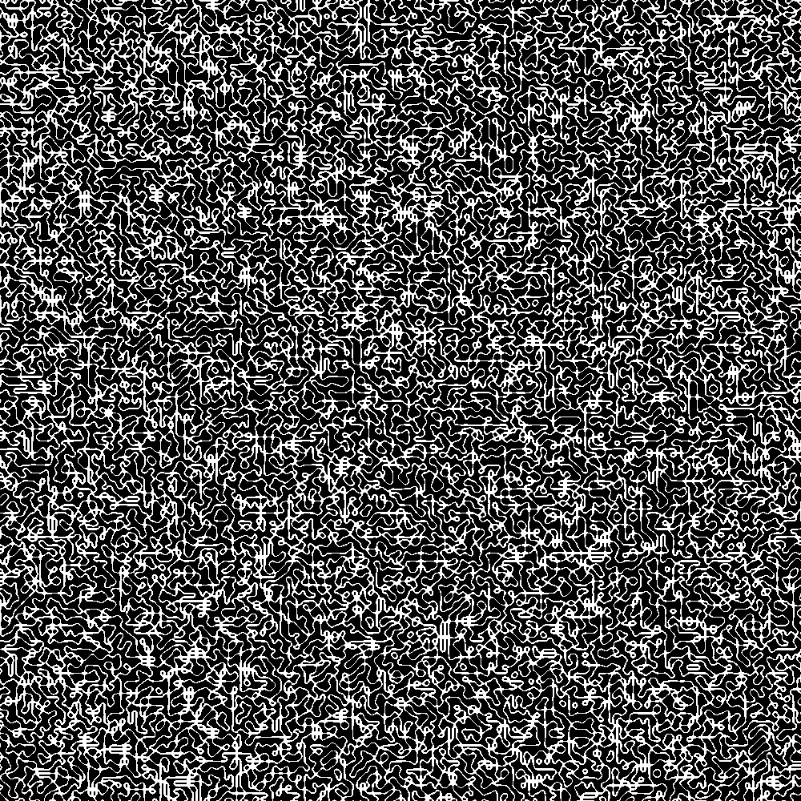

A script that generates randomized mazes/labyrinths.
Invented by accident.

Prerequisites:
Python3
PIL (pip install Pillow)

numpy (pip install numpy)

noise (pip install noise)

Run the script with no arguments to display an image on screen and save it to disk

You can specify image dimensions with -im_w, -im_h for image width and height, respectively.

You can specify a noise threshold, beyond which pixels will be black, by using -t.

You can specify a random seed using -s, which can be any number.

```
python maze.py file_name.png -im_w 500 -im_h 500 -t 0.1 -s 3459
```




